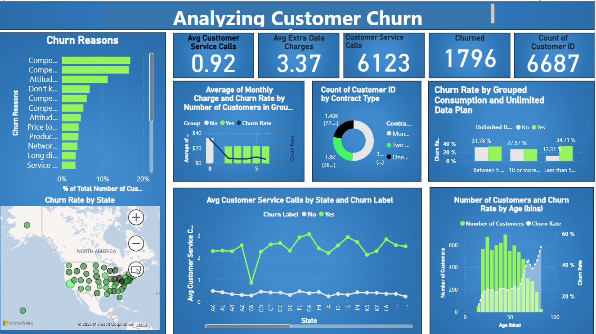

# Customer Churn Analysis - Power BI 📊

## 📊 Dashboard Preview

## 📝 Introduction
This project aims to analyze customer churn using data collected from a telecommunications company. The analysis helps identify the main factors leading to customer churn, such as customer age, geographic region, data usage, and other related factors.

## 🎯 Objectives
- Identify key factors influencing customer churn.
- Understand trends in customer data using Power BI.
- Provide solutions to help reduce churn rates.

## 🛠 Requirements
- Power BI (to view the interactive dashboard).
- Python or any other analytical tools for advanced analysis of the data.
- Data files (CSV or any other format) such as `Databel - Data.csv`.

## 📈 How to Use
1. Download the data file from [here](Databel - Data.csv).
2. Open the Power BI file `Rebort.pbix` in Power BI to view the interactive dashboard.
3. Analyze customer churn data in the various dashboards.

## 📊 Results
- **Churn Rate by Age**: This chart shows the impact of different age groups on churn rates.
- **Churn Rate by Consumption**: This highlights the relationship between data usage and churn decisions.
- **Churn Reasons**: This chart displays the main reasons for customer churn.

## 🚀 Future Improvements
- Add AI-based analysis to predict customer churn.
- Enhance the model by including additional factors such as customer satisfaction or service ratings.

## 🙌 Contributors
- [Abdullah Al-Khalileh]
